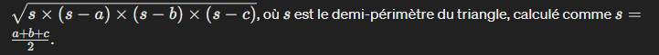

i will resolve some codeWars problem here for the GOMYCODE plateform

\*\*\*Exercises
Problem 1 : Vowel Counter

Return the number (count) of vowels in the given string.

We will consider a, e, i, o, u as vowels for this Kata (but not y).

The input string will only consist of lower case letters and/or spaces.

Problem 2 : Is this a triangle

Implement a function that accepts 3 integer values a, b, c. The function should return true if a triangle can be built with the sides of given length and false in any other case.

(In this case, all triangles must have surface greater than 0 to be accepted).

Examples:

Input -> Output
1,2,2 -> true
4,2,3 -> true
2,2,2 -> true
1,2,3 -> false
-5,1,3 -> false
0,2,3 -> false
1,2,9 -> false

// en algèbre , la somme des 3 côtés d'un triangle est toujours plus grande que le 3 , si c'est le cas , on a un triangle 
pour calculer l'aire etant donné que je ne peux savoir quel côoté est la hauteurs du trriangle , je vais utilise r la formule de héron 

 Problem 3 : credit Card Mask 
 Usually when you buy something, you're asked whether your credit card number, phone number or answer to your most secret question is still correct. However, since someone could look over your shoulder, you don't want that shown on your screen. Instead, we mask it.

Your task is to write a function maskify, which changes all but the last four characters into '#'.

Examples (input --> output):
"4556364607935616" --> "############5616"
     "64607935616" -->      "#######5616"
               "1" -->                "1"
                "" -->                 ""

// "What was the name of your first pet?"
"Skippy" --> "##ippy"
"Nananananananananananananananana Batman!" --> "####################################man!"

Algorithme  : 

- transformer l'argument en tableau 
- Couper le tableau au  niveau du caractère en 4e position avant la fin du tableau  et enregistrer dans une variable 
- lancer une boucle qui entre des "#" dans une autre liste selon le nombre d'élémnt avant la 4e lettre avant la fin de la liste 

- Joindre ces deux tableau et creer une seule chaine de caractère e lancer les test 
